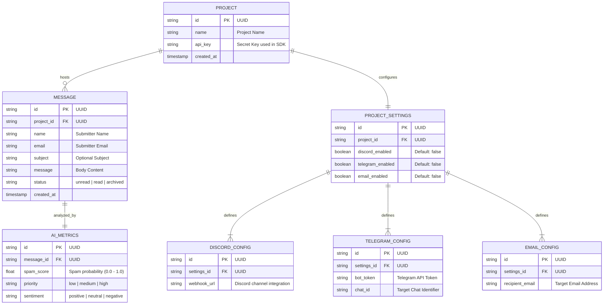

# Strata - Snowflake Database Schema

This document maps out the normalized **Snowflake Schema** representing Strata's database layout. By splitting channel configurations and AI metrics into sub-dimension tables, we minimize redundancy and enforce clean relationships.

---

## 📊 Database Schema Entity-Relationship (ER) Diagram

---

## 🗄️ Relational Mapping Table

| Table Name | Schema Type | Parent Table | Relationship | Key Fields |
| :--- | :--- | :--- | :--- | :--- |
| **`MESSAGE`** | Fact Table | `PROJECT` | Many-to-One (`project_id`) | `id` (PK), `project_id` (FK), `name`, `email`, `subject`, `message`, `status` |
| **`PROJECT`** | Dimension Table | None | One-to-Many (`MESSAGE`) | `id` (PK), `name`, `api_key`, `created_at` |
| **`AI_METRICS`** | Dimension Table | `MESSAGE` | One-to-One (`message_id`) | `id` (PK), `message_id` (FK), `spam_score`, `priority`, `sentiment` |
| **`PROJECT_SETTINGS`** | Dimension Table | `PROJECT` | One-to-One (`project_id`) | `id` (PK), `project_id` (FK), `discord_enabled`, `telegram_enabled`, `email_enabled` |
| **`DISCORD_CONFIG`** | Sub-Dimension Table | `PROJECT_SETTINGS` | One-to-One (`settings_id`) | `id` (PK), `settings_id` (FK), `webhook_url` |
| **`TELEGRAM_CONFIG`** | Sub-Dimension Table | `PROJECT_SETTINGS` | One-to-One (`settings_id`) | `id` (PK), `settings_id` (FK), `bot_token`, `chat_id` |
| **`EMAIL_CONFIG`** | Sub-Dimension Table | `PROJECT_SETTINGS` | One-to-One (`settings_id`) | `id` (PK), `settings_id` (FK), `recipient_email` |
